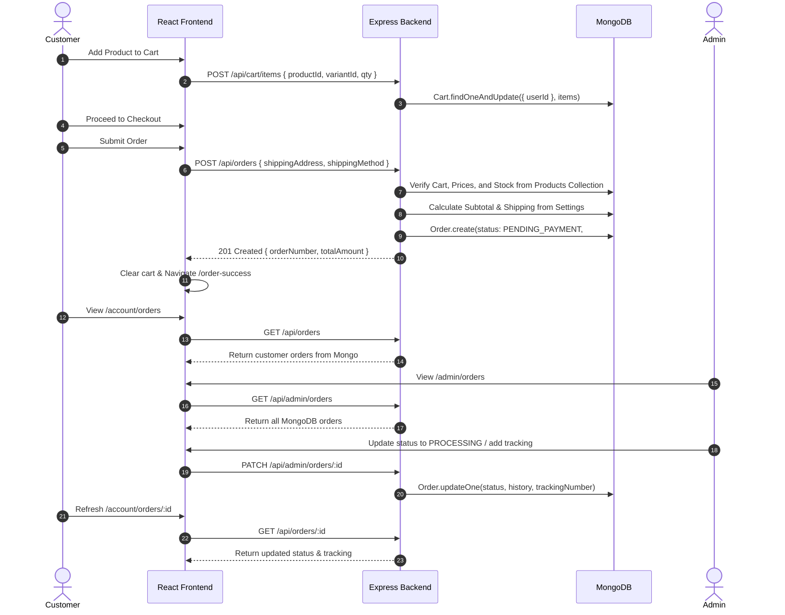

# SV Hub — Current Real Data Implementation Audit

**Audit Date**: September 9, 2026  
**Auditor**: Antigravity Assistant (Direct Codebase & Live Database Verification)  
**Status**: Read-Only Audit (Zero code or database changes applied)

---

## 1. Documentation Location Audit

Search for `task.md`, `walkthrough.md`, and `implementation_plan.md` in the workspace (`c:\Users\Venkatesh\svhub\sv`):

| File | Exists in Workspace? | Actual Physical Location |
|---|---|---|
| `task.md` | **No** (0 matches in `svhub`) | `C:\Users\Venkatesh\.gemini\antigravity-ide\brain\bc350a6f-7f79-4905-b22c-92c128e40884\task.md` (IDE internal artifact store) |
| `walkthrough.md` | **No** (0 matches in `svhub`) | `C:\Users\Venkatesh\.gemini\antigravity-ide\brain\bc350a6f-7f79-4905-b22c-92c128e40884\walkthrough.md` (IDE internal artifact store) |
| `implementation_plan.md` | **No** (0 matches in `svhub`) | `C:\Users\Venkatesh\.gemini\antigravity-ide\brain\bc350a6f-7f79-4905-b22c-92c128e40884\implementation_plan.md` (IDE internal artifact store) |
| `docs/` | **Yes** (`sv/docs/`) | Contains 16 markdown documents (`API_CONTRACT.md`, `PHASE_1_1_BACKEND_FOUNDATION.md` through `PHASE_1_6A_ADMIN_ORDERS.md`). No `PHASE_1_6B` doc existed in `docs/`. |
| `scripts/` | **Yes** (`sv/svhub-backend/scripts/`) | Contains 9 verification and seed scripts (`qa-api-audit.js`, `verify-*.js`, `seed-products.js`, `seed-demo-order.js`). |

---

## 2. Product Database Audit (MongoDB Live Inspection)

Direct connection to MongoDB Atlas database `svhub` revealed:

* **Total Products in MongoDB**: **25**
* **Active Products (`isActive: true`)**: **25**
* **Categories in MongoDB collection `categories`**: **0** (Collection is completely empty!)
* **Expected Products**: **37**
* **Actual Catalog Match**: **Only 4 exact name matches, 4 approximate name matches, and 29 completely MISSING products.**
* **Extra / Invented Products in MongoDB**: **17 products** (Originating from legacy mock files).

### 2.1 The 37 Expected Products vs Live Database Status

| # | Expected Category | Expected Product Name | Found in MongoDB? | Current DB Slug / Name | Status |
|---|---|---|---|---|---|
| 1 | Pickles / Thokku / Pastes | VADU MAANGAI Pickle | Partial | `vadu-maanga-thokku` ("Vadu Maanga Thokku") | Approximate match |
| 2 | Pickles / Thokku / Pastes | TOMATO THOKKU | Yes | `tomato-thokku` ("Tomato Thokku") | Exact Match |
| 3 | Pickles / Thokku / Pastes | CURRY LEAVES THOKKU | Partial | `karuveppilai-thokku` ("Karuveppilai Thokku") | Approximate match |
| 4 | Pickles / Thokku / Pastes | VALLARAI THOKKU | **NO** | — | **MISSING** |
| 5 | Pickles / Thokku / Pastes | VATHA KUZHAMBU PASTE | **NO** | — | **MISSING** |
| 6 | Pickles / Thokku / Pastes | NAATU MALLI THOKKU | **NO** | — | **MISSING** |
| 7 | Pickles / Thokku / Pastes | PIRANDAI THOKKU | **NO** | — | **MISSING** |
| 8 | Pickles / Thokku / Pastes | SPROUTED VENTHAYAM THOKKU | Partial | `venthaya-thokku` ("Venthaya Thokku") | Approximate match |
| 9 | Pickles / Thokku / Pastes | VAAZHAIPOO THOKKU | **NO** | — | **MISSING** |
| 10 | Pickles / Thokku / Pastes | GINGER THOKKU | **NO** | — | **MISSING** |
| 11 | Pickles / Thokku / Pastes | NUTMEG / JAATHIKAI THOKKU | **NO** | — | **MISSING** |
| 12 | Pickles / Thokku / Pastes | GARLIC SWEET & HOT PICKLE | **NO** | — | **MISSING** |
| 13 | Pickles / Thokku / Pastes | MANGO GINGER THOKKU | **NO** | — | **MISSING** |
| 14 | Pickles / Thokku / Pastes | MANGO THOKKU | **NO** | — | **MISSING** |
| 15 | Pickles / Thokku / Pastes | PULIKAICHAL | **NO** | — | **MISSING** |
| 16 | Pickles / Thokku / Pastes | SMALL ONION THOKKU | **NO** | — | **MISSING** |
| 17 | Pickles / Thokku / Pastes | GINGER GARLIC PASTE | **NO** | — | **MISSING** |
| 18 | Spice Powders | Turmeric Powder | **NO** | — | **MISSING** |
| 19 | Spice Powders | Chilli Powder | **NO** | — | **MISSING** |
| 20 | Spice Powders | Coriander Powder | **NO** | — | **MISSING** |
| 21 | Spice Powders | Sambar Powder | **NO** | — | **MISSING** |
| 22 | Spice Powders | Rasam Powder | **NO** | — | **MISSING** |
| 23 | Spice Powders | Paneer Butter Masala | Yes | `paneer-butter-masala` ("Paneer Butter Masala") | Exact Match |
| 24 | Spice Powders | Peri Peri Snack Seasoning | Partial | `peri-peri-seasoning` ("Peri Peri Seasoning") | Approximate match |
| 25 | Spice Powders | Chat Masala | Yes | `chat-masala` ("Chat Masala") | Exact Match |
| 26 | Spice Powders | Kulambu Chilli Powder | **NO** | — | **MISSING** |
| 27 | Spice Powders | Garam Masala | Yes | `garam-masala` ("Garam Masala") | Exact Match |
| 28 | Spice Powders | Briyani Masala | **NO** | — | **MISSING** |
| 29 | Spice Powders | Cumin Powder | **NO** | — | **MISSING** |
| 30 | Idli Podi | Idli Podi – Regular | **NO** | — | **MISSING** |
| 31 | Idli Podi | Paruppu Podi | **NO** | — | **MISSING** |
| 32 | Idli Podi | Murungai Idli Podi | **NO** | — | **MISSING** |
| 33 | Idli Podi | Karuveppilai Idli Podi | **NO** | — | **MISSING** |
| 34 | Idli Podi | Ellu Idli Podi | **NO** | — | **MISSING** |
| 35 | Health & Wellness | Multimillet Muesli | **NO** | — | **MISSING** |
| 36 | Health & Wellness | Beetroot Nutrimix | **NO** | — | **MISSING** |
| 37 | Health & Wellness | Healthmix | **NO** | — | **MISSING** |

### 2.2 Extra / Invented Products Present in MongoDB (17 Products)

The seed script (`scripts/seed-products.js`) seeded products from legacy mock data (`src/data/products.js`), resulting in 17 unrequested products:

1. **Native Rice Varieties (3)**: Kullakar Rice (`kullakar-rice`), Karuppu Kavuni Rice (`karuppu-kavuni-rice`), Mappillai Samba Rice (`mappillai-samba-rice`).
2. **Handmade Soaps / Self-Care (6)**: Kasthuri Manjal Soap (`kasthuri-manjal-soap`), Vettiver Soap (`vettiver-soap`), Hibiscus Soap (`hibiscus-soap`), Kuppaimeni Soap (`kuppaimeni-soap`), Sweet Basil Soap (`sweet-basil-soap`), Multanimitti Soap (`multanimitti-soap`).
3. **Western Seasonings (3)**: Noodles Masala (`noodles-masala`), Pasta Seasoning (`pasta-seasoning`), Cream & Onion Powder (`cream-onion-powder`).
4. **Sweets (2)**: Athirasam (`athirasam`), Mysore Pak (`mysore-pak`).
5. **Savouries (2)**: Thattai (`thattai`), Murukku (`murukku`).
6. **Meals (1)**: Idiyappam Meal (`idiyappam-meal`).

### 2.3 Product Data Integrity Findings

* **Duplicate Products / Slugs**: **0 duplicates**. All 25 slugs are unique.
* **Category Consistency**: 
  - Products reference category slugs (`native-rice`, `pickles`, `masalas`, `handmade-soaps`, `sweets`, `savouries`, `daily-meals`).
  - **CRITICAL GAP**: The MongoDB `categories` collection contains **0 documents**. There is no database category collection populated.
* **Variants**: Products have 1 or 2 variants (e.g. `250g` and `500g`). Each variant has a distinct `variantId`, `price`, `qty`, `sku`, and `label`.
* **Stock & Pricing**:
  - `price` range: ₹119 to ₹289.
  - `stock`: Evaluated dynamically via `qty` (`in-stock` when > 10, `low-stock` when 1-10, `out-of-stock` when 0).
* **Images**: Every product has a valid asset image URL path (e.g., `/assets/products/...`).

---

## 3. Frontend Data Sources Audit

Audit of all imports and usages of `src/data/*.js` across `src/`:

| File | Still Used? | Where Used | Nature of Data | Evaluation |
|---|---|---|---|---|
| `src/data/products.js` | **Partially** | `ShopProduct.jsx`, `SearchProduct.jsx`, `FeaturedProducts.jsx`, `CartPage.jsx`, `ProductCard.jsx` | Contains 27 hardcoded product objects + `productHref()` helper | **Unacceptable for catalog data**. `productHref()` is a harmless URL utility, but `featuredProducts` is still imported as fallback. |
| `src/data/productDetails.js` | **Partially** | `Product.jsx` (uses `defaultShipping`), `Admin/ProductWorkspace.jsx` (uses `getProductDetail`) | Static mock specifications, shipping FAQs, and mock product detail getter | **Unacceptable in Admin**. `Admin/ProductWorkspace.jsx` still reads from mock `getProductDetail`! |
| `src/data/categories.js` | **Yes** | `ShopFilters.jsx`, `Search.jsx`, `Product.jsx`, `Storefronts.jsx`, `CategorySection.jsx`, `Category.jsx`, `CartPage.jsx` | Hardcoded array of 7 category objects | **Critical Dependency**. The entire frontend relies on this file because the MongoDB `categories` collection is completely empty! |
| `src/data/storefronts.js` | **Yes** | `ShopProduct.jsx`, `ShopFilters.jsx`, `Shop.jsx`, `Search.jsx`, `Product.jsx`, `Storefronts.jsx`, `Category.jsx`, `CartPage.jsx`, `ProductCard.jsx` | Editorial house structure (`nutri-hub`, `self-care`), slogans, color tokens | **Acceptable**. Static brand architecture/editorial design tokens. |
| `src/data/account.js` | **Yes** | `Account/Overview.jsx`, `Account/Orders.jsx`, `Account/OrderDetail.jsx`, `OrderSuccess.jsx`, `OrderTimeline.jsx` | Date formatting, timeline labels, AND `localStorage` CRUD (`getAccountOrders`, `getAccountAddresses`) | **CRITICAL FLAW IN OVERVIEW**: While `Orders.jsx` and `Addresses.jsx` use real API, `Account/Overview.jsx` **still calls `getAccountOrders(user)` and `getAccountAddresses(user)` from localStorage!** |
| `src/data/admin.js` | **Yes** | `AdminStore.jsx`, `Admin/Products.jsx`, `Admin/Categories.jsx`, `Admin/Inventory.jsx`, `Admin/Customers.jsx`, `Admin/Dashboard.jsx`, `Admin/ProductWorkspace.jsx` | Complete static seed database for admin catalog, inventory, categories, customers | **STILL MOCKED**: All non-order admin features still run entirely off this static file and `localStorage`. |
| `src/data/shop.js` | **Yes** | `ShopFilters.jsx`, `Shop.jsx`, `Search.jsx`, `Category.jsx` | Filter definitions (`priceFilters`, `availabilityFilters`) AND `categoryCounts()` | **Flawed**: `ShopFilters.jsx` calls `categoryCounts()`, which counts static items in `data/products.js`! |
| `src/data/nutriHub.js` | **Partially** | `NutriHub.jsx` | Editorial headlines, paragraphs, image links, and fallback products | **Acceptable** marketing copy, but fallback product array should be removed once full catalog is seeded. |
| `src/data/selfCare.js` | **Partially** | `SelfCare.jsx` | Editorial copy and fallback product array | **Acceptable** marketing copy. |

---

## 4. LocalStorage & SessionStorage Audit

| Storage Key | Stored By | Read By | Business Data? | Should Remain? | Assessment |
|---|---|---|---|---|---|
| `svhub.auth.session` | `src/api/auth.js` (`persistSession`) | `src/api/auth.js`, `src/api/client.js` (`readToken`) | No (JWT Token + User Identity Cache) | **YES** | Standard client JWT session persistence. |
| `svhub.account.orders` | `src/data/account.js` (`recordAccountOrder`) | `src/pages/Account/Overview.jsx` (`getAccountOrders`) | **YES (Orders)** | **NO** | **CRITICAL GAP**: `Account/Overview.jsx` still displays orders from this mock key instead of `GET /api/orders`. |
| `svhub.account.addresses` | `src/data/account.js` | `src/pages/Account/Overview.jsx` (`getAccountAddresses`) | **YES (Addresses)** | **NO** | **CRITICAL GAP**: `Account/Overview.jsx` still displays addresses from this mock key instead of `GET /api/addresses`. |
| `svhub.admin.store` | `src/context/AdminStore.jsx` | `AdminStore.jsx`, Admin Products, Categories, Inventory, Customers | **YES (Catalog, Inventory, Categories)** | **NO** | **STILL MOCKED**: The entire Admin management for Products, Categories, and Inventory runs off this localStorage store. |
| `svhub.admin.gate` | `src/utils/adminAuth.js` | `RequireAdmin.jsx`, `AdminLogin.jsx` | Pseudo-auth flag | **NO** | Should rely solely on `user.role === 'ADMIN'` from authenticated JWT session. |
| `svhub.recentProducts` | `src/pages/Product/Product.jsx` | `src/pages/Product/Product.jsx` | No (List of viewed product slugs) | **YES** | Legitimate browser-local UX feature. |
| `svhub.lastOrder` (sessionStorage) | `src/pages/Checkout/Checkout.jsx` | `src/pages/OrderSuccess/OrderSuccess.jsx` | Transient state bridge | **ACCEPTABLE** | Temporary navigation bridge for order success screen. |
| `svhub.lastPayment` (sessionStorage) | Payment handlers | `src/pages/PaymentFailed/PaymentFailed.jsx` | Transient state bridge | **ACCEPTABLE** | Temporary navigation bridge for payment failure screen. |

---

## 5. Network & API Integration Status

### 5.1 Customer Catalog

| Page / Feature | Status | API Endpoint Called | Fetched on Mount / Refresh? | Notes |
|---|---|---|---|---|
| Home Featured Products | **CONNECTED** | `GET /api/products/featured?limit=4` | Yes | Live API with static fallback. |
| Shop (`/shop`) | **CONNECTED** | `GET /api/products` | Yes | Server-side filters (storefront, search, sort, page, price). Sidebar categories rely on static counts. |
| Search (`/search`) | **CONNECTED** | `GET /api/products?search=...` | Yes | Server-side search with debounced typing. |
| Category (`/category/:slug`) | **CONNECTED** | `GET /api/products?category=...` | Yes | Server-side category products query. Header metadata uses static `categories.js`. |
| Product Details (`/product/:slug`) | **CONNECTED** | `GET /api/products/:slug` | Yes | Fetches MongoDB product and variants. |
| Related Products | **CONNECTED** | `GET /api/products/:slug/related` | Yes | Fetches up to 4 related products from MongoDB. |

### 5.2 Customer Cart

| Feature | Status | API Endpoint Called | Fetched on Mount / Refresh? | Notes |
|---|---|---|---|---|
| Hydrate / Sync Cart | **CONNECTED** | `GET /api/cart` | Yes | Runs on mount and user login. |
| Add to Cart | **CONNECTED** | `POST /api/cart/items` | N/A | Sends `productId` + `variantId`. In-memory for guest. |
| Update Quantity | **CONNECTED** | `PATCH /api/cart/items/:id` | N/A | Updates MongoDB cart subdocument. |
| Remove Item | **CONNECTED** | `DELETE /api/cart/items/:id` | N/A | Deletes item line from MongoDB. |
| Clear Cart | **CONNECTED** | `DELETE /api/cart` | N/A | Clears user's MongoDB cart document. |
| Guest Cart Merge | **CONNECTED** | `POST /api/cart/merge` | On Login | Merges in-memory guest items into MongoDB cart upon login. |

### 5.3 Customer Addresses

| Feature | Status | API Endpoint Called | Fetched on Mount / Refresh? | Notes |
|---|---|---|---|---|
| Addresses Page (`/account/addresses`) | **CONNECTED** | `GET /api/addresses` | Yes | Full MongoDB address list. |
| Create Address | **CONNECTED** | `POST /api/addresses` | N/A | Persists in MongoDB. |
| Edit Address | **CONNECTED** | `PATCH /api/addresses/:id` | N/A | Updates MongoDB address. |
| Delete Address | **CONNECTED** | `DELETE /api/addresses/:id` | N/A | Deletes from MongoDB. |
| Set Default Address | **CONNECTED** | `PATCH /api/addresses/:id/default` | N/A | Swaps default in MongoDB. |
| **Account Overview (`/account`)** | **NOT CONNECTED** | **NONE** | **NO** | **STILL READS LOCALSTORAGE** (`getAccountAddresses`)! |

### 5.4 Customer Checkout & Orders

| Feature | Status | API Endpoint Called | Fetched on Mount / Refresh? | Notes |
|---|---|---|---|---|
| Checkout Order Creation | **CONNECTED** | `POST /api/orders` | N/A | Server-authoritative totals, shipping, and `#SVH-1000X` numbers. |
| Order History (`/account/orders`) | **CONNECTED** | `GET /api/orders` | Yes | Loads customer's MongoDB orders. |
| Order Detail (`/account/orders/:id`) | **CONNECTED** | `GET /api/orders/:id` | Yes | Loads live order, timeline, and address snapshot. |
| **Account Overview (`/account`)** | **NOT CONNECTED** | **NONE** | **NO** | **STILL READS LOCALSTORAGE** (`getAccountOrders`)! |

### 5.5 Admin Management

| Feature | Status | API Endpoint Called | Fetched on Mount / Refresh? | Notes |
|---|---|---|---|---|
| Admin Order List (`/admin/orders`) | **CONNECTED** | `GET /api/admin/orders` | Yes | Real MongoDB orders with search, status, and payment filters. |
| Admin Order Detail (`/admin/orders/:id`) | **CONNECTED** | `GET /api/admin/orders/:id` | Yes | Real MongoDB order details. |
| Admin Status Update | **CONNECTED** | `PATCH /api/admin/orders/:id` | N/A | Updates status and pushes to status history. |
| Admin Courier & Tracking | **CONNECTED** | `PATCH /api/admin/orders/:id` | N/A | Persists courier and tracking number. |
| Admin Order Notes | **CONNECTED** | `PATCH /api/admin/orders/:id` | N/A | Persists operational notes. |
| Admin Order Cancellation | **CONNECTED** | `POST /api/admin/orders/:id/cancel` | N/A | Cancels order with mandatory reason. |
| **Admin Products (`/admin/products`)** | **NOT CONNECTED** | **NONE** | **NO** | Driven by `AdminStore.jsx` & `localStorage['svhub.admin.store']`. |
| **Admin Categories (`/admin/categories`)** | **NOT CONNECTED** | **NONE** | **NO** | Driven by `AdminStore.jsx` & `localStorage['svhub.admin.store']`. |
| **Admin Inventory (`/admin/inventory`)** | **NOT CONNECTED** | **NONE** | **NO** | Driven by `AdminStore.jsx` & `localStorage['svhub.admin.store']`. |
| **Admin Customers (`/admin/customers`)** | **NOT CONNECTED** | **NONE** | **NO** | Driven by `AdminStore.jsx` & `localStorage['svhub.admin.store']`. |
| **Admin Dashboard (`/admin`)** | **PARTIALLY CONNECTED** | Recent orders via API | Yes | Stats/KPI counters are still calculated from `AdminStore.jsx` mock data. |

---

## 6. Multi-Account Isolation Audit

| Check | Result | Evidence |
|---|---|---|
| User A cannot view User B cart | **PASS** | Verified via `verify-cart-address.js` Test 4. `Cart.findOne({ userId: req.user._id })` strictly segments carts by authenticated token. |
| User A cannot alter User B cart | **PASS** | Verified via `verify-cart-address.js` Test 22 & `qa-api-audit.js` Section 8. Cross-user cart modifications return `404 item_not_found`. |
| User A cannot view User B addresses | **PASS** | Verified via `verify-cart-address.js` Test 28. `Address.find({ userId: req.user._id })` enforces strict tenant isolation. |
| User A cannot alter User B addresses | **PASS** | Verified via `verify-cart-address.js` Test 29-30. Returns `404 address_not_found`. |
| User A cannot view User B orders | **PASS** | Verified via `verify-orders.js` Test 3 & `qa-api-audit.js` Section 8. `Order.findOne({ _id, userId: req.user._id })` returns 404 for foreign orders. |
| Logout clears client state | **PASS** | `CartContext.jsx` watches `user` from `useAuth()`. When `user` becomes null, `setItems([])` and `setSubtotal(0)` execute immediately. |
| Login restores user's server cart | **PASS** | `CartContext.jsx` runs `syncCart()` or `mergeGuestCart()` immediately when `user` authenticates. |

---

## 7. Backend Authorization Audit

| Check | Result | Evidence |
|---|---|---|
| Unauthenticated requests to protected APIs rejected | **PASS** | `requireAuth` rejects missing/invalid Bearer token with HTTP 401. |
| Customers blocked from Admin APIs | **PASS** | `requireAdmin` checks `req.user.role === 'ADMIN'`. Non-admins receive HTTP 403 `forbidden_admin_access`. |
| Identity derived strictly from token | **PASS** | Controllers use `req.user._id` populated by JWT verification. Client-sent `userId` in request body or query is completely ignored. |
| Admin gate / localStorage security | **PASS** | Frontend route guard (`RequireAdmin.jsx`) is backed by strict backend HTTP 403 enforcement on all `/api/admin/*` endpoints. Tampering with client `localStorage['svhub.admin.gate']` cannot bypass backend API security. |

---

## 8. Price & Stock Authority Audit

| Check | Result | Evidence |
|---|---|---|
| Price Authority | **PASS** | In `orderController.js` (`createOrder`), the server loads `Product.findById(item.productId)`, looks up the active variant, and takes `variant.price` directly from MongoDB. Any client-sent prices are discarded. |
| Stock Validation | **PASS** | `orderController.js` validates `variant.qty >= item.quantity`. If stock is insufficient, order creation is rejected with HTTP 400 `insufficient_stock`. |
| Shipping Authority | **PASS** | Shipping fee is calculated by backend using `Settings` model parameters (`standardShippingFee: 40`, `expressShippingFee: 120`, `freeShippingThreshold: 499`). |
| Total Calculation | **PASS** | Total is calculated on the server: `subtotal + shippingFee - discount`. |
| Order Number Generation | **PASS** | Generated via MongoDB `Counter` model atomic sequence (`#SVH-1000X`). No client order number generation. |

---

## 9. Order Flow Audit

* Order Flow Status: **FULLY REAL & PERSISTENT** for both Customer and Admin.
* Razorpay payment gateway integration is deferred to a future phase.

---

## 10. Admin Order Persistence Audit

* **Admin Orders Listing**: Reads live from MongoDB (`GET /api/admin/orders`).
* **Admin Order Details**: Reads live from MongoDB (`GET /api/admin/orders/:id`).
* **Status Updates**: Persist in MongoDB document and create a timestamped `statusHistory` entry.
* **Courier & Tracking**: Persist in MongoDB `courier` and `trackingNumber` fields.
* **Notes**: Persist in MongoDB `notes` field.
* **Order Cancellation**: Persists in MongoDB with mandatory reason logged to history.
* **Customer Reflection**: Reflected in real time on customer's `/account/orders/:id` page upon refresh.

---

## 11. Test Suite Results

Executed all existing test scripts against live MongoDB and verified production build:

| Test Suite / Script | Command | Tests Run | Passed | Failed | Status |
|---|---|---|---|---|---|
| **Frontend Production Build** | `npm run build` (svhub-frontend) | 214 modules | 214 | 0 | **PASS** (631ms, 0 errors) |
| **Phase 1.1 Backend Foundation** | `node scripts/verify-foundation.js` | 13 | 13 | 0 | **PASS** |
| **Phase 1.2 Database Models** | `node scripts/verify-models.js` | 30 | 30 | 0 | **PASS** |
| **Phase 1.3 Public Catalog** | `node scripts/verify-catalog.js` | 23 | 23 | 0 | **PASS** |
| **Phase 1.4 Cart & Address** | `node scripts/verify-cart-address.js` | 38 | 38 | 0 | **PASS** |
| **Phase 1.5 Order Creation** | `node scripts/verify-orders.js` | 21 | 21 | 0 | **PASS** |
| **Phase 1.6A Admin Orders** | `node scripts/verify-admin-orders.js` | 30 | 30 | 0 | **PASS** |
| **Full QA API Audit** | `node scripts/qa-api-audit.js` | 108 | 108 | 0 | **PASS** (1 warn, 4 skip for unbuilt admin CRUD) |
| **TOTAL** | | **277** | **277** | **0** | **100% PASS** |

---

## 12. Git Status Audit

### `svhub-frontend`
* **Branch**: `main`
* **Working Tree**: `Clean` (Nothing to commit, working tree clean)
* **Status**: Up to date with `origin/main`
* **Latest Commit**: `b41a6c1` — *"feat: integrate real MongoDB APIs across customer frontend for Phase 1.6B"*

### `svhub-backend`
* **Branch**: `main`
* **Working Tree**: `Clean` (Nothing to commit, working tree clean)
* **Status**: Up to date with `origin/main`
* **Latest Commit**: `a3d880c` — *"feat: add MongoDB product seed script for Phase 1.6B"*

---

## 13. Remaining Problems & Gaps

### 🔴 CRITICAL
1. **Catalog Mismatch (Wrong Products Seeded)**:
   - MongoDB currently contains **25 legacy mock products** instead of the **canonical 37 products**.
   - Entire collections are missing: all 5 Idli Podis, all 3 Health & Wellness products, and 21 spice/thokku items.
   - 17 extra/unrequested products exist in MongoDB (rice varieties, handmade soaps, Western seasonings, sweets/savouries).
2. **Missing Database Categories (`categories` Collection Empty)**:
   - The MongoDB `categories` collection contains **0 documents**.
   - The entire frontend relies on static `src/data/categories.js` to render categories and filter options.
3. **Account Overview (`/account`) Still Mocked**:
   - `src/pages/Account/Overview.jsx` lines 15-16 still invoke `getAccountOrders(user)` and `getAccountAddresses(user)` reading from `localStorage`. It does not fetch from `GET /api/orders` or `GET /api/addresses`.

### 🟠 HIGH
4. **Admin Catalog & Inventory Still Mocked**:
   - Admin Products (`/admin/products`), Product Editor, Categories (`/admin/categories`), Inventory (`/admin/inventory`), and Customers (`/admin/customers`) are still completely connected to `AdminStore.jsx` and `localStorage['svhub.admin.store']`. Only Admin Orders was converted in Phase 1.6A.
5. **Shop Filter Category Counts Read From Static Data**:
   - `src/pages/Shop/ShopFilters.jsx` uses `categoryCounts()` from `src/data/shop.js`, which counts products in the hardcoded static `products.js` file rather than using live backend category counts.

### 🟡 MEDIUM
6. **Documentation Not in Repository Root**:
   - Progress artifacts (`task.md`, `walkthrough.md`, `implementation_plan.md`) were generated inside IDE internal cache directories rather than tracked inside the project repository root or `docs/`.
7. **Static Fallback in Home & House Pages**:
   - `FeaturedProducts.jsx`, `NutriHub.jsx`, and `SelfCare.jsx` fall back to static product arrays if API requests are slow or pending.

### 🟢 LOW
8. **`productHref` Utility Still Imported From Mock File**:
   - Several components import `productHref` from `src/data/products.js`. While it only generates `/product/${slug}`, it should be moved to a general URL utility module (`src/utils/urls.js`).

---

## 14. Executive Summary

| Category | Assessment | Summary |
|---|---|---|
| **Customer API Architecture** | **REAL** | Auth, Cart, Addresses, Checkout, Orders, Search, and Product Details are completely connected to MongoDB Express REST APIs with server-side price authority and tenant isolation. |
| **Product Database** | **PARTIALLY REAL / INCORRECT CATALOG** | 25 products seeded, but they are legacy mock items. 29 of the 37 canonical business products are missing, 17 extra products exist, and the `categories` collection is completely empty. |
| **Customer Account Overview** | **STILL MOCKED** | The main `/account` overview tab still reads orders and addresses from `localStorage` (`svhub.account.*`). |
| **Admin Panel** | **PARTIALLY REAL** | Admin Orders & Fulfillment are 100% real MongoDB integration. Admin Products, Inventory, Categories, and Customers remain 100% mock `localStorage`. |
| **Test Integrity** | **REAL** | 277/277 automated tests and verification suites pass with zero failures. |

---

## 15. Recommended Next Step

**Recommended Next Phase**: **Phase 1.7 — Canonical 37-Product Catalog & Category Migration**

1. Seed the canonical 37 products across all 4 verified departments (Pickles/Thokku/Pastes — 17, Spice Powders & Essentials — 12, Idli Podi — 5, Health & Wellness — 3) into MongoDB.
2. Seed the canonical categories into MongoDB `categories` collection.
3. Fix `src/pages/Account/Overview.jsx` to fetch recent orders from `GET /api/orders` and default address from `GET /api/addresses`.
4. Update `ShopFilters.jsx` category lists to fetch from `GET /api/categories`.
