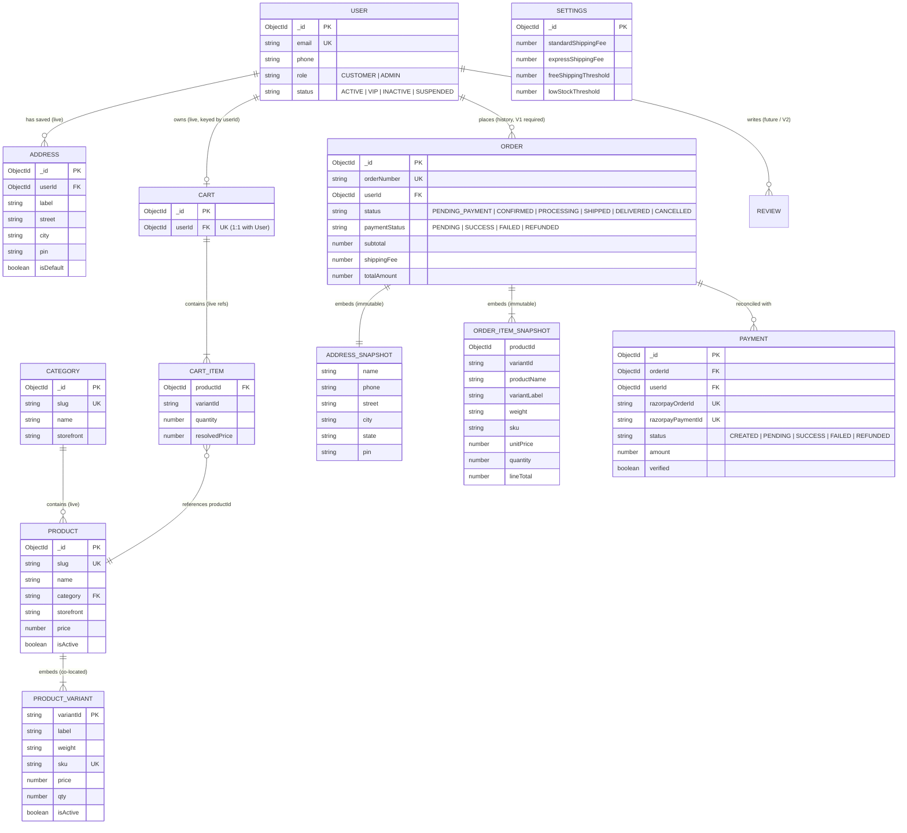

# SV Hub — Entity Relationship Design & Data Flow Specification (Phase 0.2 Final Freeze)

> **Document Version:** 2.1.0 (Phase 0.2 Final Freeze)  
> **Database:** MongoDB 7.0+ (Mongoose ODM)  
> **Core Architectural Principle:** Strict distinction between **Live Dynamic References** (for operational identity and catalog lookups) and **Historical Immutable Snapshots** (for financial, invoice, and fulfillment audit integrity).

---

## 1. Live References vs. Historical Snapshots Classification

| Entity Relationship | Architecture Pattern | Rationale & Integrity Rule |
| :--- | :--- | :--- |
| **`Product` → `variants[]`** | **Embedded Subdocuments (`1 : N`)** | Discrete pack sizes (500g, 1kg) co-located with product data. Guarantees zero-join PDP queries and atomic stock updates. |
| **`Product` → `Category`** | **Live Dynamic Reference (`N : 1`)** | Products reference `Category.slug`. Allows dynamic catalog filtering and category-level merchandising. |
| **`User` → `Cart`** | **Live Dynamic Reference (`1 : 1`)** | Each customer owns one live shopping cart document in MongoDB keyed by `userId`. Cleared upon verified payment confirmation. |
| **`Cart` → `CartItem[]`** | **Embedded References with Price Lookups** | Cart lines reference `productId` and `variantId`, but display prices are freshly resolved from `Product.variants` on fetch. |
| **`User` → `Address`** | **Live Dynamic Reference (`1 : N`)** | Saved customer addresses in address book for quick reuse during checkout. |
| **`Order` → `User`** | **Live Dynamic Reference (`N : 1`)** | Orders reference `User._id` for customer account order history. (V1 requires authenticated checkout). |
| **`Order` → `items[]`** | **IMMUTABLE HISTORICAL SNAPSHOT** | Deep copies `productName`, `variantId`, `variantLabel`, `weight`, `sku`, `unitPrice`, `quantity`, and `lineTotal`. Future price hikes or product deletions NEVER alter historical orders. |
| **`Order` → `shippingAddress`** | **IMMUTABLE HISTORICAL SNAPSHOT** | Deep copies recipient `name`, `phone`, `street`, `city`, `state`, `pin`, `lines`. Customer editing their address book NEVER alters historical orders. |
| **`Order` → `Payment`** | **Decoupled Relational Audit Link (`1 : N`)**| Separate transactional audit collection storing Razorpay orders, payment IDs, verification signatures, and webhook payloads. |
| **`User` / `Product` → `Review`** | **Live Dynamic Reference (Future / V2)** | Verified reviews linking `productId` and `userId`. Not implemented in Phase 1 (no PDP reviews UI). |
| **`Settings`** | **Independent Singleton Document** | Store-wide operational configuration (shipping fees, free shipping thresholds, support contacts). |

---

## 2. Definitive Entity Relationship Diagram (ERD)

---

## 3. Cardinality, Cascade & Referential Integrity Rules

### 3.1 User ↔ Cart (`1 : 1`)
* **Storage:** Single `carts` document per registered customer keyed strictly by `userId` in V1.
* **Integrity Rule:** Exactly one cart per `userId`. Pre-login guest items are merged via `POST /api/cart/merge` upon authentication.
* **Clearing Rule:** The cart is cleared (`items: []`) **ONLY** after successful payment signature verification and order confirmation.

### 3.2 Category ↔ Product (`1 : N`)
* **Storage:** `Product.category` references `Category.slug`.
* **Cascade Behavior:** `RESTRICT`. An admin cannot delete a category if active products are assigned to it. The system responds with HTTP `409 Conflict`.

### 3.3 Product ↔ Embedded Variant (`1 : N`)
* **Storage:** Co-located in `product.variants[]`.
* **Integrity Rule:** Each variant within a product has a unique `variantId` and `sku`. Variants are updated atomically with the parent product document.

### 3.4 Order ↔ Product Snapshots (Historical Isolation)
* **Storage:** Embedded in `order.items[]`.
* **Integrity Rule:** Absolutely zero dynamic references to the live `products` collection during order lookup or receipt rendering.
* **Invariant:** If a product name changes or price changes in the catalogue, historical orders retain their exact snapshot.

### 3.5 Order ↔ Address Snapshots (Address Book Isolation)
* **Storage:** Embedded in `order.shippingAddress`.
* **Integrity Rule:** Absolutely zero dynamic references to the customer's `addresses` collection.
* **Invariant:** If a customer deletes an address or changes their home address, past orders reflect the exact destination where the package was originally routed.

### 3.6 Order ↔ Payment (`1 : N`)
* **Storage:** `Payment.orderId` references `Order._id`.
* **Reconciliation Rule:** Multiple payment attempts may exist for a single application order if previous attempts failed. However, exactly one payment record can achieve `status: 'SUCCESS'` and `verified: true` for a confirmed order.
