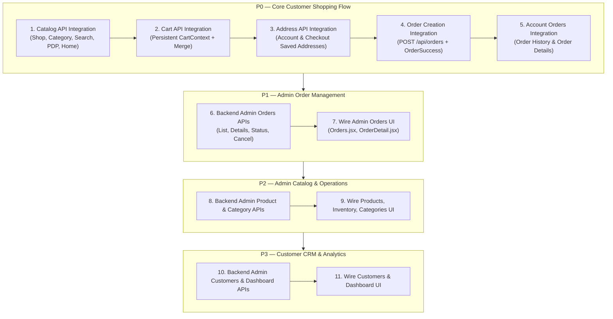

# SV HUB — FRONTEND ↔ BACKEND INTEGRATION AUDIT

> **Audit Date:** September 9, 2026  
> **Status:** AUDIT COMPLETE — BASELINE FROZEN  
> **Target Branches / Repositories:** `svhub-frontend` & `svhub-backend`  
> **Scope:** End-to-End Analysis of Customer Storefront, Admin Portal, Data Layers, State Management, and Backend APIs (Phases 1.1 – 1.5).

---

## 1. Executive Summary

SV Hub has successfully built and verified the core backend foundation through Phase 1.5, including JWT authentication, public catalog APIs, authenticated customer cart, saved addresses, and order creation. All 108 backend QA audit tests pass with zero critical defects.

However, the customer-facing frontend (`svhub-frontend`) and the administrative back-office portal (`/admin`) were originally engineered with local mock fixtures (`src/data/*.js`), in-memory React state (`CartContext`), and `localStorage` persistence (`AdminStore`, `account.js`). 

### Key Audit Findings

1. **Authentication is the only connected system:** `AuthContext.jsx` and `src/api/auth.js` actively communicate with the live backend (`/api/auth/*`). Customer registration, password login, Google OAuth, password reset, and profile updates are connected to MongoDB Atlas.
2. **Customer catalog, cart, addresses, and checkout are disconnected:**
   - The catalog (`Shop.jsx`, `Category.jsx`, `Search.jsx`, `FeaturedProducts.jsx`, `Product.jsx`) renders exclusively from static JSON files (`products.js`, `productDetails.js`, `categories.js`).
   - The customer cart (`CartContext.jsx`, `CartPage.jsx`) stores items in volatile React state (`useState([])`) without calling `/api/cart/*` or merging on login.
   - Address management in Account (`Addresses.jsx`) mutates `localStorage` (`svhub.account.addresses`) instead of calling `/api/addresses`.
   - Checkout (`Checkout.jsx`) manufactures random `#SVH-XXXXX` order numbers and saves simulated `Confirmed` orders into `sessionStorage` and `localStorage`, bypassing `POST /api/orders`.
3. **Admin portal is completely mock/localStorage-driven:**
   - All admin routes (`/admin`, `/admin/orders`, `/admin/products`, `/admin/inventory`, `/admin/categories`, `/admin/customers`, `/admin/settings`) read and write to `window.localStorage['svhub.admin.store']` via `AdminStore.jsx`.
   - Zero administrative backend APIs currently exist in `svhub-backend`. All admin mutations are local to the browser session.
4. **Authoritative business logic resides in the browser:**
   - Product prices, discounts, delivery charges (₹40 standard / ₹120 express), stock validation, and order sequence counters are currently trusted from client state.
   - These calculations must migrate to the backend before public launch.

### Summary Metrics

| Metric | Count | Details |
| :--- | :--- | :--- |
| **Total Backend APIs Implemented** | **24** | Auth (8), Catalog (4), Categories (2), Settings (1), Cart (6), Addresses (6), Orders (3) — *(some shared)* |
| **Backend APIs Currently Called by Frontend** | **7** | `/api/auth/register`, `login`, `google`, `forgot-password`, `reset-password` (GET/POST), `profile` |
| **Backend APIs Disconnected (Ready for Frontend Wire-up)** | **17** | Catalog (4), Categories (2), Settings (1), Cart (6), Addresses (6), Orders (3), `/api/auth/me` |
| **Missing Admin Backend APIs Required by UI** | **16** | Admin Orders (4), Admin Products (5), Admin Categories (3), Admin Customers (2), Admin Settings/Metrics (2) |
| **Customer Pages Connected** | **1** | `/account/profile` |
| **Customer Pages Using Mocks / LocalStorage** | **6** | Home, Shop/Catalog, Product Details, Cart, Checkout, Account (Orders/Addresses) |
| **Admin Pages Using Mocks / LocalStorage** | **8** | Dashboard, Orders, Order Details, Products, Product Workspace, Inventory, Categories, Customers, Settings |

---

## 2. Customer Frontend Integration Matrix

| Page | Feature | Current Data Source | Backend API Available? | Frontend Calls API? | Required API Endpoint | Status | Action Required |
| :--- | :--- | :--- | :--- | :--- | :--- | :--- | :--- |
| **Home** | Featured Products | `src/data/products.js` (`featuredProducts`) | **YES** | **NO** | `GET /api/products/featured` | `FRONTEND MOCK` | Replace static array with `getFeaturedProducts()` call. |
| **Home** | Everyday Categories | `src/data/categories.js` | **YES** | **NO** | `GET /api/categories` | `FRONTEND MOCK` | Fetch active categories from backend. |
| **Home** | Storefront Houses | `src/data/storefronts.js` | **PARTIAL** | **NO** | `GET /api/categories` / `GET /api/settings/public` | `FRONTEND MOCK` | Keep presentation metadata (accent tokens) in frontend; drive counts/categories from backend. |
| **Home** | Testimonials / Voices | `src/data/testimonials.js` | **NO** | **NO** | None (Reviews planned Phase 2) | `FRONTEND MOCK` | Retain static curation until Reviews API is scheduled. |
| **Shop** | Product Listing | `src/data/products.js` | **YES** | **NO** | `GET /api/products` | `FRONTEND MOCK` | Connect listing to `/api/products` with query params. |
| **Shop** | Pagination | Client slicing (`queryShop` in `shop.js`) | **YES** | **NO** | `GET /api/products?page=X&limit=Y` | `FRONTEND MOCK` | Use backend `pagination` payload (`page`, `totalPages`, `total`). |
| **Shop** | Search | Client substring matching | **YES** | **NO** | `GET /api/products?search=...` | `FRONTEND MOCK` | Forward search term `q` to backend text index. |
| **Shop** | Category Filtering | Client filter on `product.category` | **YES** | **NO** | `GET /api/products?category=...` | `FRONTEND MOCK` | Pass category slug to backend. |
| **Shop** | Storefront Filtering | Client filter on `product.storefront` | **YES** | **NO** | `GET /api/products?storefront=...` | `FRONTEND MOCK` | Pass storefront enum (`nutri-hub`, `self-care`). |
| **Shop** | Price Range Filtering | Client filter on `product.price` | **YES** | **NO** | `GET /api/products?minPrice=X&maxPrice=Y` | `FRONTEND MOCK` | Pass price bounds to backend. |
| **Shop** | Sorting | Client array sort | **YES** | **NO** | `GET /api/products?sort=...` | `FRONTEND MOCK` | Map sort options (`price-asc`, `price-desc`, `newest`). |
| **Shop** | Stock Availability | Hardcoded `'in-stock'` string | **YES** | **NO** | `GET /api/products` | `FRONTEND MOCK` | Use backend `stock` (`in-stock`, `low-stock`, `out-of-stock`) and `inStock`. |
| **Product Detail** | Product Information | `src/data/productDetails.js` | **YES** | **NO** | `GET /api/products/:id` (by slug or ID) | `FRONTEND MOCK` | Wire PDP loader to fetch product by route `:slug`. |
| **Product Detail** | Pack Variants | Hardcoded variant array | **YES** | **NO** | `GET /api/products/:id` (`product.variants`) | `FRONTEND MOCK` | Render pack selector from backend `variants`. |
| **Product Detail** | Pricing / Discount | Hardcoded prices in `productDetails.js` | **YES** | **NO** | `GET /api/products/:id` | `FRONTEND MOCK` | Bind price, originalPrice, and discount to backend response. |
| **Product Detail** | Real-time Stock | Hardcoded `'in-stock'` | **YES** | **NO** | `GET /api/products/:id` | `FRONTEND MOCK` | Disable "Add to Cart" if `inStock === false`. |
| **Product Detail** | Related Products | Client filter `relatedFor()` | **YES** | **NO** | `GET /api/products/:id/related` | `FRONTEND MOCK` | Fetch related products via backend endpoint. |
| **Product Detail** | Recently Viewed | `localStorage['svhub.recentProducts']` | **NO** | **NO** | None (client feature) | `LOCALSTORAGE` | Keep client-side; optionally hydrate product summaries. |
| **Cart** | Cart Items & Quantity | React `useState([])` in `CartContext` | **YES** | **NO** | `GET /api/cart`, `POST /api/cart/items` | `FRONTEND MOCK` | Synchronize `CartContext` with backend Cart API. |
| **Cart** | Item Pricing & Subtotal | Client summation (`price * qty`) | **YES** | **NO** | `GET /api/cart` (`subtotal`, `lineTotal`) | `FRONTEND MOCK` | Display authoritative backend line totals and subtotal. |
| **Cart** | Stock Verification | Static `MAX_QTY = 12` | **YES** | **NO** | `PATCH /api/cart/items/:id` | `FRONTEND MOCK` | Backend enforces inventory limits. |
| **Cart** | Guest-to-User Merge | None (cart resets or stays isolated) | **YES** | **NO** | `POST /api/cart/merge` | `FRONTEND MOCK` | Merge guest cart items into user account on login. |
| **Address** | Address List | `localStorage['svhub.account.addresses']` | **YES** | **NO** | `GET /api/addresses` | `LOCALSTORAGE` | Load customer addresses from backend. |
| **Address** | Create Address | Mutates `localStorage` | **YES** | **NO** | `POST /api/addresses` | `LOCALSTORAGE` | Post address payload to backend. |
| **Address** | Edit Address | Mutates `localStorage` | **YES** | **NO** | `PATCH /api/addresses/:id` | `LOCALSTORAGE` | Send updates to backend. |
| **Address** | Delete Address | Mutates `localStorage` | **YES** | **NO** | `DELETE /api/addresses/:id` | `LOCALSTORAGE` | Call backend deletion endpoint. |
| **Address** | Default Address | Mutates `localStorage` | **YES** | **NO** | `PATCH /api/addresses/:id/default` | `LOCALSTORAGE` | Call default toggle endpoint. |
| **Checkout** | Saved Address Selector | Manual form entry only | **YES** | **NO** | `GET /api/addresses` | `FRONTEND MOCK` | Add radio selector for authenticated saved addresses. |
| **Checkout** | Cart Item Snapshot | In-memory `items` array | **YES** | **NO** | `GET /api/cart` | `FRONTEND MOCK` | Pull authoritative items from database cart. |
| **Checkout** | Shipping Fee | Hardcoded (`₹40` std / `₹120` exp) | **YES** | **NO** | `GET /api/settings/public` | `FRONTEND MOCK` | Read `freeShippingFrom` and `standardShipping` from settings. |
| **Checkout** | Order Creation | Client mock + `sessionStorage` | **YES** | **NO** | `POST /api/orders` | `FRONTEND MOCK` | Submit `{ shippingAddressId, deliveryType }` to backend. |
| **Account** | Profile Details | Live user state in `AuthContext` | **YES** | **YES** | `PATCH /api/auth/profile` | `CONNECTED` | Already connected and verified. |
| **Account** | Orders List | `localStorage['svhub.account.orders']` | **YES** | **NO** | `GET /api/orders` | `LOCALSTORAGE` | Load authenticated customer's order history from backend. |
| **Account** | Order Details | `localStorage['svhub.account.orders']` | **YES** | **NO** | `GET /api/orders/:id` | `LOCALSTORAGE` | Load order details by ID from backend. |

---

## 3. Mock & Static Data Inventory

The frontend codebase contains 17 static data files in `src/data/` and uses 7 browser storage keys.

### Static Data Files in `src/data/`

| File | Size | Primary Exports | Actively Imported By | Nature of Data |
| :--- | :--- | :--- | :--- | :--- |
| `products.js` | 8.3 KB | `products`, `featuredProducts`, `productHref` | `Shop.jsx`, `CartPage.jsx`, `FeaturedProducts.jsx`, `OrderDetail.jsx`, `ProductCard.jsx`, `ShopProduct.jsx` | 18 static products with prices, images, and category slugs. |
| `productDetails.js` | 20.1 KB | `productDetails`, `getProductDetail`, `relatedFor`, `readViewed` | `Product.jsx`, `ProductWorkspace.jsx` | Full catalog specifications, ingredients, gallery, pack variants, and localStorage recent-views tracker. |
| `categories.js` | 2.2 KB | `categories`, `getCategoryBySlug`, `getCategoriesByStorefront` | `CategorySection.jsx`, `Storefronts.jsx`, `ShopFilters.jsx`, `Category.jsx`, `CartPage.jsx`, `PlaceholderPage.jsx` | 7 category records (Rice, Thokku, Soaps, Oils, Podi, Masalas, Sweeteners). |
| `storefronts.js` | 1.1 KB | `storefronts`, `getStorefront` | `Storefronts.jsx`, `Shop.jsx`, `CartPage.jsx`, `Category.jsx`, `FeaturedProducts.jsx`, `ProductCard.jsx` | Brand definitions for Nutri Hub and Self Care, theme tokens (`terracotta`, `charcoal-green`). |
| `account.js` | 12.5 KB | `getAccountOrders`, `getAccountOrder`, `recordAccountOrder`, `getAccountAddresses`, `upsertAccountAddress` | `Overview.jsx`, `Orders.jsx`, `OrderDetail.jsx`, `Addresses.jsx`, `Checkout.jsx`, `OrderSuccess.jsx` | Mock order generator, mock addresses, and localStorage CRUD sync. |
| `admin.js` | 16.3 KB | `seedAdminStore`, `ADMIN_STORAGE_KEY`, `ORDER_STATUSES`, `PAYMENT_STATUSES`, helper formatters | `AdminStore.jsx`, `Dashboard.jsx`, `Orders.jsx`, `Products.jsx`, `Categories.jsx`, `Customers.jsx`, `Inventory.jsx` | Full demo data seed for Admin dashboard: 18 products, 7 categories, 6 sample orders, 6 customers, store settings. |
| `shop.js` | 7.1 KB | `queryShop`, `parseShopParams`, `sortOptions`, `priceFilters`, `availabilityFilters` | `Shop.jsx`, `Category.jsx`, `Search.jsx`, `ShopFilters.jsx` | Client-side search, filtering, and pagination engine. |
| `home.js` | 4.1 KB | `heroContent`, `featuredIntro`, `categoryIntro`, `housesIntro`, `whyItems`, `editorial` | `Home.jsx` child components | Marketing copy, slogans, stat badges, and storytelling layout configurations. |
| `testimonials.js` | 779 B | `testimonials`, `testimonialsIntro` | `Testimonials.jsx` | 4 customer reviews with names, locations, and quotes. |
| `nutriHub.js` | 2.5 KB | `nutriHubIntro`, `nutriHubPantry`, `nutriHubFeatured` | `NutriHub.jsx` | Landing page layout and product IDs for the Nutri Hub house. |
| `selfCare.js` | 2.3 KB | `selfCareIntro`, `selfCareRitual`, `selfCareFeatured` | `SelfCare.jsx` | Landing page layout and product IDs for the Self Care house. |
| `about.js`, `contact.js`, `terms.js`, `refund.js`, `shipping.js` | ~30 KB | Static content and policy objects | Legal & institutional pages (`/about`, `/contact`, `/privacy`, `/terms`) | Static legal and brand copy (permanent). |

### Browser Storage Keys

| Storage Key | Storage Mechanism | Purpose | Current Behavior | Target State |
| :--- | :--- | :--- | :--- | :--- |
| `svhub.auth.session` | `localStorage` | JWT token and user profile | **Active & Connected** | Retain as primary session storage. |
| `svhub.admin.gate` | `localStorage` | Frontend admin gate token | Hardcoded local check (`admin` / `admin123`) | Replace with real admin JWT verification. |
| `svhub.admin.store` | `localStorage` | Complete admin back-office database | Stores products, orders, categories, customers | Replace with real Admin REST APIs. |
| `svhub.account.orders` | `localStorage` | Customer order history | Client mock storage | Replace with `GET /api/orders`. |
| `svhub.account.addresses` | `localStorage` | Saved customer delivery addresses | Client mock storage | Replace with `GET /api/addresses`. |
| `svhub.lastOrder` | `sessionStorage` | Placed order payload | Hand-off from Checkout to `/order-success` | Retain as lightweight transition cache populated from `POST /api/orders`. |
| `svhub.lastPayment` | `sessionStorage` | Payment failure diagnostic data | Hand-off from failed checkout to `/payment-failed` | Retain for payment redirect recovery. |
| `svhub.recentProducts` | `localStorage` | Recently viewed product IDs on PDP | Client-side history | Keep client-side (no backend change required). |

---

## 4. Existing Backend API Usage Mapping

The backend implementation through Phase 1.5 exposes **24 production endpoints**. Here is their direct usage status from the frontend:

```text
ENDPOINT                              STATUS IN FRONTEND        CALLING FILE / MODULE
---------------------------------------------------------------------------------------------
POST /api/auth/register               CONNECTED                 src/api/auth.js (register)
POST /api/auth/login                  CONNECTED                 src/api/auth.js (login)
POST /api/auth/google                 CONNECTED                 src/api/auth.js (loginWithGoogle)
POST /api/auth/forgot-password        CONNECTED                 src/api/auth.js (requestReset)
GET  /api/auth/reset-password         CONNECTED                 src/api/auth.js (inspectResetToken)
POST /api/auth/reset-password         CONNECTED                 src/api/auth.js (resetPassword)
PATCH /api/auth/profile               CONNECTED                 src/api/auth.js (updateProfile)
GET  /api/auth/me                     NOT CALLED (DISCONNECTED) Safe session restore unused on boot
POST /api/auth/logout                 NOT CALLED (DISCONNECTED) Frontend only removes local storage
GET  /api/products                    NOT CALLED (DISCONNECTED) Shop uses products.js
GET  /api/products/featured           NOT CALLED (DISCONNECTED) Home uses featuredProducts
GET  /api/products/:id                NOT CALLED (DISCONNECTED) PDP uses productDetails.js
GET  /api/products/:id/related        NOT CALLED (DISCONNECTED) PDP uses relatedFor()
GET  /api/categories                  NOT CALLED (DISCONNECTED) Home/Shop use categories.js
GET  /api/categories/:id              NOT CALLED (DISCONNECTED) Unused
GET  /api/settings/public             NOT CALLED (DISCONNECTED) Checkout uses hardcoded ₹40/₹120
GET  /api/cart                        NOT CALLED (DISCONNECTED) Cart uses useState([])
POST /api/cart/items                  NOT CALLED (DISCONNECTED) Cart uses useState([])
PATCH /api/cart/items/:id             NOT CALLED (DISCONNECTED) Cart uses useState([])
DELETE /api/cart/items/:id            NOT CALLED (DISCONNECTED) Cart uses useState([])
DELETE /api/cart                      NOT CALLED (DISCONNECTED) Cart uses useState([])
POST /api/cart/merge                  NOT CALLED (DISCONNECTED) No guest-to-user cart merge
GET  /api/addresses                   NOT CALLED (DISCONNECTED) Account uses localStorage
POST /api/addresses                   NOT CALLED (DISCONNECTED) Account uses localStorage
PATCH /api/addresses/:id              NOT CALLED (DISCONNECTED) Account uses localStorage
PUT  /api/addresses/:id               NOT CALLED (DISCONNECTED) Account uses localStorage
DELETE /api/addresses/:id             NOT CALLED (DISCONNECTED) Account uses localStorage
PATCH /api/addresses/:id/default      NOT CALLED (DISCONNECTED) Account uses localStorage
POST /api/orders                      NOT CALLED (DISCONNECTED) Checkout uses fake order generator
GET  /api/orders                      NOT CALLED (DISCONNECTED) Account Orders uses localStorage
GET  /api/orders/:id                  NOT CALLED (DISCONNECTED) Account OrderDetail uses localStorage
```

---

## 5. Missing Backend API Requirements

The following APIs are required by the existing frontend UI but have **not yet been implemented** on the backend:

### 1. Administrative APIs (Highest Gap)
The frontend admin portal has complete UI for managing orders, products, stock, categories, customers, and store settings, but the backend lacks any admin routes:

* `GET /api/admin/dashboard` — Metric cards (revenue, orders count, AOV, active products, low-stock alerts) and sales revenue chart.
* `GET /api/admin/orders` — Paginated order list with search, status filters (`status`, `payment`), storefront filter, and date-range filters.
* `GET /api/admin/orders/:id` — Full order detail including snapshot items, customer details, timeline, tracking info, and internal notes.
* `PATCH /api/admin/orders/:id` — Update order status, payment status, tracking number, courier partner, and internal notes.
* `POST /api/admin/orders/:id/cancel` — Cancel order with mandatory operational reason.
* `GET /api/admin/products` — Paginated admin catalog listing (including inactive items and stock quantities).
* `POST /api/admin/products` — Create new product with variants and specifications.
* `GET /api/admin/products/:id` — Full product workspace record for editing.
* `PUT /api/admin/products/:id` — Update product details, pricing, variants, and specifications.
* `DELETE /api/admin/products/:id` — Deactivate or soft-delete product.
* `PATCH /api/admin/products/:id/inventory` — Quick stock quantity adjustment from Inventory view.
* `GET /api/admin/categories` — Category list with assigned product counts.
* `POST /api/admin/categories` — Create category.
* `PUT /api/admin/categories/:id` — Update category details and storefront association.
* `DELETE /api/admin/categories/:id` — Delete category (with dependency validation).
* `GET /api/admin/customers` — Paginated customer list with order counts, lifetime spend, and status.
* `GET /api/admin/customers/:id` — Customer detail modal with order history and internal notes.
* `PATCH /api/admin/customers/:id` — Toggle account status (`ACTIVE` / `INACTIVE`) and save notes.
* `GET /api/admin/settings` & `PATCH /api/admin/settings` — Manage operational settings (free shipping threshold, standard delivery charge, low-stock threshold, support email).

### 2. Customer Payment & Checkout APIs (Scheduled for Phase 1.6)
* `POST /api/payments/razorpay/create-order` — Create Razorpay order for an existing application order.
* `POST /api/payments/razorpay/verify` — Verify Razorpay signature (`razorpay_order_id`, `razorpay_payment_id`, `razorpay_signature`).

---

## 6. Admin Frontend Audit & Integration Matrix

| Admin Page | Current Data Source | Current Actions in UI | Required Backend API | API Exists? | Missing API Endpoints |
| :--- | :--- | :--- | :--- | :--- | :--- |
| **`/admin`** (Dashboard) | `localStorage['svhub.admin.store']` | Metric cards (Revenue, Orders, AOV, Low Stock), Sales chart (7d/30d), Recent orders table, Top products, Storefront split | `GET /api/admin/dashboard` | **NO** | `GET /api/admin/dashboard` |
| **`/admin/orders`** | `localStorage['svhub.admin.store']` | Search orders, Filter by status, payment, storefront, date range; Sort columns; Advance status; Cancel order; Quick view drawer; Export CSV/JSON | `GET /api/admin/orders`, `PATCH /api/admin/orders/:id` | **NO** | `GET /api/admin/orders`, `PATCH /api/admin/orders/:id`, `POST /api/admin/orders/:id/cancel` |
| **`/admin/orders/:orderId`** | `localStorage['svhub.admin.store']` | View timeline stages; Change order status; Change payment status; Add courier & tracking; Save operational notes; Customer profile link; Cancel order | `GET /api/admin/orders/:id`, `PATCH /api/admin/orders/:id` | **NO** | `GET /api/admin/orders/:id`, `PATCH /api/admin/orders/:id` |
| **`/admin/products`** | `localStorage['svhub.admin.store']` | Product table; Search; Filter by storefront, category, stock; Toggle active/inactive; Delete product; Pagination | `GET /api/admin/products`, `DELETE /api/admin/products/:id` | **NO** | `GET /api/admin/products`, `DELETE /api/admin/products/:id` |
| **`/admin/products/new`** & **`/edit/:id`** | `localStorage['svhub.admin.store']` | Full product form: Name, slug, house, category, prices, SKU, qty, image, gallery, weight, ingredients, details, active | `POST /api/admin/products`, `GET /api/admin/products/:id`, `PUT /api/admin/products/:id` | **NO** | `POST /api/admin/products`, `GET /api/admin/products/:id`, `PUT /api/admin/products/:id` |
| **`/admin/inventory`** | `localStorage['svhub.admin.store']` | Inventory table; Low stock warning filter; Quick-adjust stock dialog; Sorting by stock count | `GET /api/admin/products`, `PATCH /api/admin/products/:id/inventory` | **NO** | `PATCH /api/admin/products/:id/inventory` |
| **`/admin/categories`** | `localStorage['svhub.admin.store']` | Category list with product counts; Create category; Edit category; Delete category; Toggle active | `GET /api/admin/categories`, `POST /api/admin/categories`, `PUT /api/admin/categories/:id`, `DELETE /api/admin/categories/:id` | **NO** | `GET /api/admin/categories`, `POST /api/admin/categories`, `PUT /api/admin/categories/:id`, `DELETE /api/admin/categories/:id` |
| **`/admin/customers`** | `localStorage['svhub.admin.store']` | Customer table; Search; Filter by status, tier; Sort by spend, orders; Customer details modal; Notes; Deactivate account | `GET /api/admin/customers`, `GET /api/admin/customers/:id`, `PATCH /api/admin/customers/:id` | **NO** | `GET /api/admin/customers`, `GET /api/admin/customers/:id`, `PATCH /api/admin/customers/:id` |
| **`/admin/settings`** | `localStorage['svhub.admin.store']` | Edit free shipping threshold, standard delivery fee, low stock alert threshold, support email; Reset demo data | `GET /api/admin/settings`, `PATCH /api/admin/settings` | **NO** | `GET /api/admin/settings`, `PATCH /api/admin/settings` |

---

## 7. Admin Order API Detailed Specification

Based on `Orders.jsx` and `OrderDetail.jsx`, the following backend contracts are required:

### 1. `GET /api/admin/orders`
* **Query Parameters:**
  - `page` (integer, default `1`)
  - `limit` (integer, default `10`)
  - `search` (string, matches orderNumber, customerName, email, phone)
  - `status` (`all` | `Pending` | `Confirmed` | `Processing` | `Shipped` | `Delivered` | `Cancelled`)
  - `paymentStatus` (`all` | `Pending` | `Paid` | `Failed` | `Refunded`)
  - `storefront` (`all` | `nutri-hub` | `self-care`)
  - `dateRange` (`all` | `7d` | `30d` | `month` | `custom`)
  - `dateFrom` & `dateTo` (ISO dates for custom range)
  - `sort` (`newest` | `oldest` | `amount-high` | `amount-low` | `number`)
* **Response:**
  ```json
  {
    "success": true,
    "orders": [
      {
        "id": "6a95a310...",
        "orderNumber": "SVH-10001",
        "createdAt": "2026-09-09T10:00:00.000Z",
        "customerName": "Priya Venkatesh",
        "email": "customer@svhub.in",
        "phone": "9876543210",
        "storefront": "nutri-hub",
        "itemCount": 3,
        "totalAmount": 747,
        "status": "CONFIRMED",
        "paymentStatus": "PAID"
      }
    ],
    "pagination": { "page": 1, "limit": 10, "total": 48, "totalPages": 5 }
  }
  ```

### 2. `GET /api/admin/orders/:id`
* **Response:** Full order details including shipping address, order items snapshot, status timeline history, courier info, tracking number, and operational notes.

### 3. `PATCH /api/admin/orders/:id`
* **Request Body:**
  ```json
  {
    "status": "SHIPPED",
    "paymentStatus": "PAID",
    "courier": "BlueDart Express",
    "trackingNumber": "BLU-SVH10001",
    "notes": "Packed in thermal insulation."
  }
  ```

### 4. `POST /api/admin/orders/:id/cancel`
* **Request Body:** `{ "reason": "Customer requested cancellation via phone" }`
* **Effect:** Sets `status = 'CANCELLED'`, records history entry, restores inventory if needed.

---

## 8. Admin Product & Inventory API Specification

Based on `Products.jsx`, `ProductWorkspace.jsx`, and `Inventory.jsx`:

### 1. `GET /api/admin/products`
* Includes inactive products, real-time stock quantities (`qty`), SKU, and full variant breakdowns.

### 2. `POST /api/admin/products` & `PUT /api/admin/products/:id`
* **Payload Structure:**
  ```json
  {
    "name": "Kullakar Rice",
    "slug": "kullakar-rice",
    "type": "Native Rice",
    "storefront": "nutri-hub",
    "category": "native-rice",
    "price": 249,
    "originalPrice": 299,
    "sku": "SVH-NH-KULLA",
    "qty": 45,
    "weight": "500 g",
    "image": "https://...",
    "gallery": ["https://..."],
    "description": "...",
    "ingredients": ["Kullakar Paddy"],
    "specifications": [{ "label": "Storage", "value": "Airtight container" }],
    "isActive": true,
    "isFeatured": false,
    "variants": [
      {
        "label": "500 g Pack",
        "weight": "500 g",
        "sku": "SVH-NH-KULLA-500",
        "price": 249,
        "originalPrice": 299,
        "qty": 45,
        "isActive": true
      }
    ]
  }
  ```

### 3. `PATCH /api/admin/products/:id/inventory`
* Dedicated fast mutation for `Inventory.jsx`: `{ "qty": 30 }`.

---

## 9. Admin Category API Specification

Based on `Categories.jsx`:

* `GET /api/admin/categories` — Returns category documents with virtual or computed `productCount` field.
* `POST /api/admin/categories` & `PUT /api/admin/categories/:id` — Supports `{ name, slug, storefront, description, isActive }`.
* `DELETE /api/admin/categories/:id` — Fails with `409 Conflict` (`category_in_use`) if active products remain assigned to this category slug.

---

## 10. Admin Customer API Specification

Based on `Customers.jsx`:

* `GET /api/admin/customers` — Returns customers with aggregate statistics:
  ```json
  {
    "id": "6aa13b3e...",
    "name": "SV Hub Customer",
    "email": "customer@svhub.in",
    "phone": "9998887776",
    "city": "Chennai",
    "state": "Tamil Nadu",
    "totalOrders": 3,
    "totalSpent": 2180,
    "status": "ACTIVE",
    "tier": "regular",
    "createdAt": "2026-09-09T10:55:58.170Z"
  }
  ```
* `GET /api/admin/customers/:id` — Returns customer profile, full order history, and notes.
* `PATCH /api/admin/customers/:id` — Supports `{ "status": "INACTIVE", "notes": "Customer requested account lock" }`.

---

## 11. API Response Mismatches & Normalization Requirements

To prevent regressions when connecting frontend components to backend endpoints, the following data format differences must be reconciled:

### 1. Status Enums (Case & Naming Mismatch)
* **Backend convention:** UPPERCASE with underscores.
  - Order status: `PENDING_PAYMENT`, `CONFIRMED`, `PROCESSING`, `SHIPPED`, `DELIVERED`, `CANCELLED`
  - Payment status: `PENDING`, `PAID`, `FAILED`, `REFUNDED`
* **Frontend UI expectation:** Title Case with spaces/dashes.
  - Order status: `Pending`, `Confirmed`, `Processing`, `Shipped`, `Delivered`, `Cancelled`
  - Payment status: `Pending`, `Paid`, `Failed`, `Refunded`
* **Solution:** Provide a bidirectional mapper in `src/api/orders.js` and `src/data/admin.js` to normalize enum values.

### 2. Order Field Names
| Field Description | Frontend Component Expectation | Backend Model Property |
| :--- | :--- | :--- |
| Order Sequence Number | `order.number` (`#SVH-98234` or `SVH-98234`) | `order.orderNumber` (`SVH-10001`) |
| Order Creation Date | `order.date` | `order.createdAt` |
| Total Price | `order.amount` and `order.total` | `order.totalAmount` |
| Delivery Fee | `order.shipping` | `order.shippingFee` |
| Item Name | `item.name` | `item.productName` |
| Item Unit Price | `item.price` | `item.unitPrice` |
| Item Subtotal | Client computes `price * qty` | `item.lineTotal` |
| Shipping Address | `order.address` (`{ lines, name, phone }`) | `order.shippingAddress` (`{ street, city, state, pin, ... }`) |

### 3. Product Identifier Format
* In `products.js`, product `id` is a slug string (e.g., `'kullakar-rice'`).
* In MongoDB, product `id` is a 24-character hexadecimal ObjectId (e.g., `'6a9586cf7b2b521e4e1b9aae'`), while `slug` is `'kullakar-rice'`.
* Frontend navigation links must use `product.slug || product.id`.

### 4. Cart Line Items Structure
* Frontend `CartContext` currently stores `{ id: product.id, ...product, quantity }`.
* Backend Cart API expects mutation payloads of `{ productId, variantId, quantity }` and returns `{ id: cartItemId, productId, variantId, name, price, weight, lineTotal, quantity }`.
* Frontend `CartContext` must map the cart item `id` to the cart item's database ID for `PATCH` and `DELETE` requests.

---

## 12. Critical Business Logic That Must Move to Backend

The following business rules are currently executed inside the browser and **MUST MOVE TO BACKEND** to safeguard transactional and pricing integrity:

1. **Product Prices & Line Totals:**
   - **Current:** Frontend computes item totals and grand total by summing `item.price * item.quantity`.
   - **Risk:** Malicious users could alter client-side cart arrays or send manipulated prices during checkout.
   - **Rule:** Backend `populateCart()` and `createOrder()` are authoritative. Frontend must display values returned by the server.
2. **Delivery & Free Shipping Calculation:**
   - **Current:** `Checkout.jsx` applies hardcoded `const STANDARD = 40` and `const EXPRESS = 120`.
   - **Rule:** Backend `Settings` (`freeShippingFrom`, `standardShipping`) dictates delivery charges based on cart subtotal.
3. **Stock & Quantity Availability:**
   - **Current:** Frontend permits any quantity up to `MAX_QTY = 12` based solely on a client `'in-stock'` string.
   - **Rule:** Backend strictly rejects additions or checkouts exceeding available variant stock (`variant.qty`).
4. **Order Sequence Number Generation:**
   - **Current:** Frontend generates `#SVH-${Math.floor(10000 + Math.random() * 90000)}` at random.
   - **Rule:** Backend atomic `Counter` sequence guarantees zero collisions and sequential auditability (`SVH-10001`, `SVH-10002`).
5. **Order & Payment Lifecycle State:**
   - **Current:** Frontend marks orders as `status: 'Confirmed'` and `paymentStatus: 'Paid'` instantly upon form submission.
   - **Rule:** Order creation sets `status: 'PENDING_PAYMENT'`. Transition to `CONFIRMED` and `PAID` is triggered only by validated payment gateway callbacks or webhooks.

---

## 13. Recommended Implementation Roadmap

To connect the application cleanly without regressions, follow this prioritized execution sequence:



### Phase Details

* **Priority 0 (P0) — Customer Commerce Flow:**
  1. Create frontend API services: `src/api/products.js`, `src/api/cart.js`, `src/api/addresses.js`, `src/api/orders.js`.
  2. Connect `Shop.jsx`, `Category.jsx`, `Search.jsx`, and `Product.jsx` to live catalog APIs.
  3. Refactor `CartContext.jsx` to sync with `/api/cart` and trigger `POST /api/cart/merge` upon authentication.
  4. Connect `Addresses.jsx` and checkout address selection to `/api/addresses`.
  5. Connect `Checkout.jsx` submission to `POST /api/orders` and pass real order ID to `/order-success`.
  6. Wire `Account/Orders.jsx` and `Account/OrderDetail.jsx` to `GET /api/orders` and `GET /api/orders/:id`.

* **Priority 1 (P1) — Admin Order Management:**
  1. Implement backend routes: `GET /api/admin/orders`, `GET /api/admin/orders/:id`, `PATCH /api/admin/orders/:id`, `POST /api/admin/orders/:id/cancel`.
  2. Connect `Admin/Orders.jsx` and `Admin/OrderDetail.jsx` to backend endpoints, replacing `AdminStore.jsx` order logic.

* **Priority 2 (P2) — Admin Products, Inventory & Categories:**
  1. Implement backend admin catalog routes for product CRUD, inventory quick-adjust, and category CRUD.
  2. Connect `Admin/Products.jsx`, `Admin/ProductWorkspace.jsx`, `Admin/Inventory.jsx`, and `Admin/Categories.jsx`.

* **Priority 3 (P3) — Admin CRM & Dashboard Analytics:**
  1. Implement `GET /api/admin/dashboard` metrics and `GET /api/admin/customers`.
  2. Connect `Admin/Dashboard.jsx` and `Admin/Customers.jsx`.
  3. Decommission `src/context/AdminStore.jsx` and `window.localStorage['svhub.admin.store']`.

---

## 14. Verification & Audit Sign-Off

* **Source Code Modification Check:**
  - Zero React or frontend source files modified.
  - Zero backend application files modified.
  - Zero database schemas or routes modified.
* **Deliverable Created:** `docs/FRONTEND_BACKEND_INTEGRATION_AUDIT.md`
